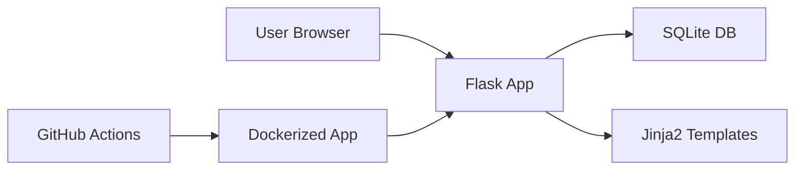

# Threat Model - NexusPortal

## Scope

NexusPortal is a Flask + SQLite project management portal with admin, member,
and viewer roles. This threat model covers browser users, Flask routes, session
cookies, SQLite data, Docker runtime, and GitHub Actions security checks.

## Assets

| Asset | Sensitivity | Notes |
|---|---|---|
| User accounts | High | Includes email, role, password hash |
| Session cookie | High | Grants authenticated access |
| Project data | Medium | Internal project descriptions and status |
| Task data | Medium | Assignees, due dates, priorities |
| Feedback | Medium | May contain bug/security details |
| Admin functions | High | Role changes and portfolio visibility |
| CI/CD artifacts | Medium | Security scan reports and evidence |

## Trust Boundaries

## Entry Points

| Entry Point | Access | Data Accepted |
|---|---|---|
| `/register` | Public | username, email, password |
| `/login` | Public | username/email, password |
| `/projects` | Authenticated | search query, status filter |
| `/projects/new` | Admin/Member | title, description, status |
| `/projects/<id>/edit` | Admin/Owner | title, description, status |
| `/projects/<id>/tasks` | Admin/Owner | task fields |
| `/feedback` | Authenticated | category, message |
| `/admin` | Admin | target user, role |

## STRIDE Table

| ID | Category | Threat | Existing/Planned Control | Risk |
|---|---|---|---|---|
| T-01 | Spoofing | Attacker guesses weak passwords | Password length/number validation, hashed passwords | Medium |
| T-02 | Tampering | Viewer submits project mutations directly | Server-side `roles_required` checks | High |
| T-03 | Tampering | Member modifies another user's project | Owner checks before edit/delete/task routes | High |
| T-04 | Repudiation | User denies feedback or project change | Add audit log as future improvement | Medium |
| T-05 | Information Disclosure | Admin page visible to non-admin | Admin-only route decorator | High |
| T-06 | Information Disclosure | XSS exposes session data | Jinja escaping, no `| safe`, HttpOnly cookie | High |
| T-07 | Denial of Service | Large form payloads | Length validation; add request size limit as improvement | Medium |
| T-08 | Elevation of Privilege | Role tampering via client/UI | Roles loaded from database and checked server-side | High |
| T-09 | Injection | SQLi through login/search forms | Parameterized SQLite queries | High |
| T-10 | Supply Chain | Vulnerable package introduced | pip-audit and Safety workflow | Medium |

## Risk Matrix

| Risk | Likelihood | Impact | Priority |
|---|---:|---:|---:|
| Broken access control | 4 | 5 | Critical |
| SQL injection | 3 | 5 | High |
| XSS | 3 | 4 | High |
| Vulnerable dependency | 3 | 4 | High |
| Weak operational config | 2 | 4 | Medium |

## Security Requirements

- All authentication queries must be parameterized.
- Passwords must be stored as hashes, never plaintext.
- Login and logout must clear the existing session.
- RBAC must be enforced server-side on every protected action.
- User content must be escaped by default in templates.
- SAST, SCA, DAST, and coverage workflows must run on GitHub.
